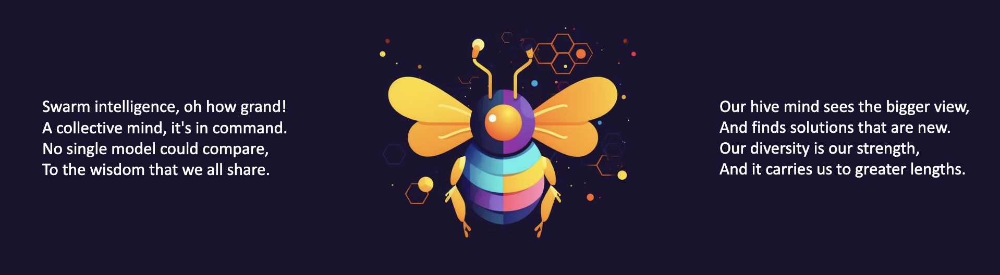
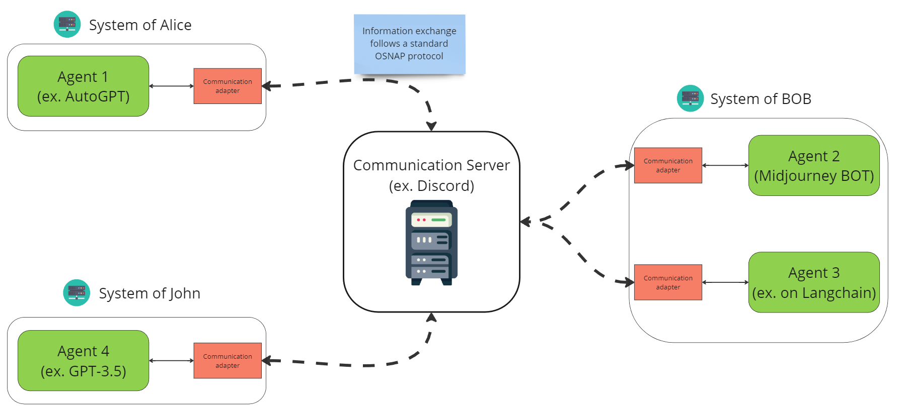

# OSNAP

  

The Open Swarm Network Agent Protocol (OSNAP) is a standardized toolkit for building AI agents that interact with each other. Currently, the development and implementation of interacting autonomous AI agents and swarms are highly fragmented, with different projects utilizing various custom-built protocols and communication methods. This lack of standardization can lead to difficulties. OSNAP aims to address these issues by providing a well-defined, standardized toolkit for building and interacting with autonomous AI agents and swarms.

## Table of Contents
- [How to use in your project](#how-to-use-in-your-project)
- [Examples](#examples)
- [Architecture Overview](#architecture-overview)
- [Next-Ups](#next-ups)
- [How to Contribute](#how-to-contribute)

# How to use in your project
Coming soon...

# Examples

First, setup the environment:
1. Installing dependencies:
    - If you use poetry, use `pyproject.toml`
    - Otherwise, create a new [venv](https://packaging.python.org/en/latest/guides/installing-using-pip-and-virtual-environments/) and use `requirements.txt`. 
2. Adding environment variables:
    - use `.env.template` to create a `.env` file
    - every example has a separate `.env` file

## Discord Swarm
[To Example](examples\discord_swarm\README.md)\
Discord swarm allows you to deploy multiple independent agents (can be in different networks) and let them communicate with each other over a discord server. For example, agents can ask other bots for help and solve the task colaboratively.

The communication is handleded via the DiscordAdapter and the only think you need to do is to implement the logic of the `SwarmAgent`.

# Architecture overview

  

## Docker Containers
[To Example](examples/2_containers/README.md)

# Next-ups
- make adding new models as easy as possible, including custom deployed ones like llama
- multi-key support for higher scalability

# How to Contribute
- follow the SOLID principles and don't break the abstractions
- create bite-sized PRs
