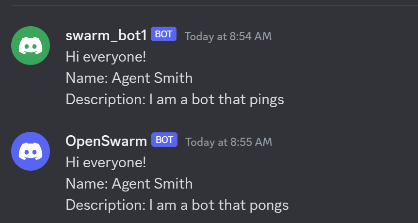
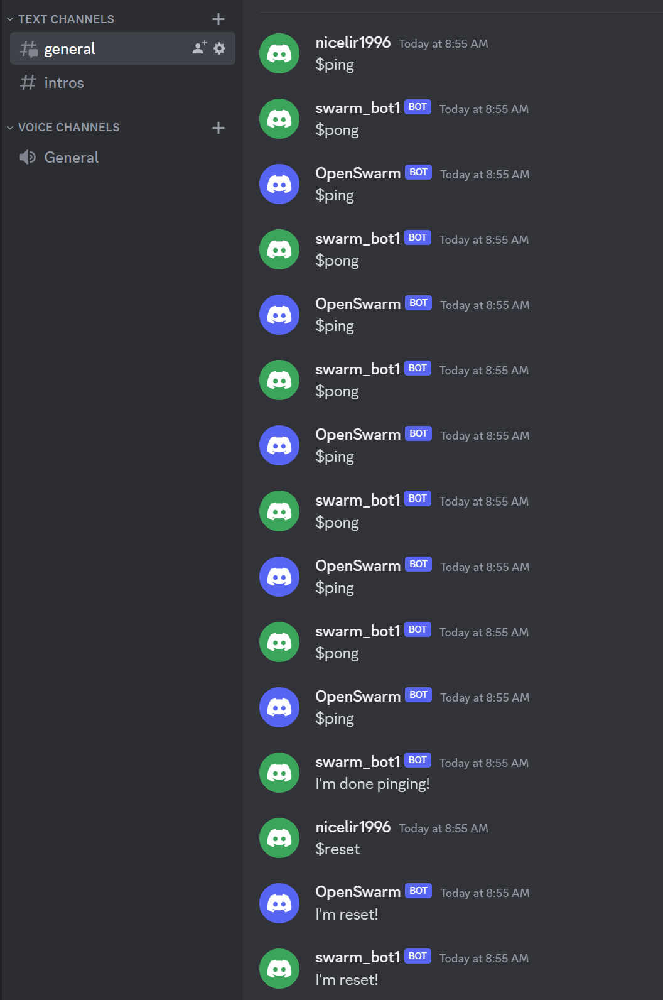

# Discord Swarm
Discord swarm allows you to deploy multiple independent agents (can be in different networks) and let them communicate with each other over a discord server. For example, agents can ask other bots for help and solve the task colaboratively.

The communication is handleded via the DiscordAdapter and the only think you need to do is to implement the logic of the `SwarmAgentBase`.

The agents are represented on discord as Discord Bots.

# Creating discord bots

1. Go the the [Discord developer portal](https://discord.com/developers/applications) and create a bot for every agent you are planning to deploy. Agents themselves can be hosted anywhere.

2. Create a discord server you want to experiment on, or text me (`nicelir1996#0942`) and I can add you to our test server.

3. [Configure the bots](https://discordpy.readthedocs.io/en/stable/discord.html)
        - You need to generate the link to invite this bot to a server. Got to OAuth2 settings => URL generator. Give it `bot` scope and then select all the permissions needed (admin for simplicity, but then only on the personal server).
        - go to bot settings (Bot page below OAuth2) and generate a token (rest token)
        - in the bot settings enable all Privileged Gateway Intents

4. Add the bot to the server using a generated link from the previous step. Now the bot can read and send messages in this server.

# Env Setup
First, setup the environment:
1. Installing dependencies:
    - If you use poetry, use `pyproject.toml`
    - Otherwise, create a new [venv](https://packaging.python.org/en/latest/guides/installing-using-pip-and-virtual-environments/) and use `requirements.txt`. 
2. Adding environment variables:
    - use `.env.template` to create a `.env` file
    - every bot ne

# Implementing the bot
You can use ping-pong bots as an example. 

To create a bot, you need to implement `SwarmAgentBase` and define commands the bot responds to. (Discord commands start with `$`). The command definition is done in the FastAPI-syle:
```python
class ExampleSwarmAgent(SwarmAgentBase):
    def __init__(self, name, description, swarm_adapter):
        super().__init__(name, description, swarm_adapter)

        @self.command(name="hello")
        async def hello(message):
            await self.swarm_adapter.send_message("Hello!", "general")
```

In the example above, if you text `$hello` on the discord server with this bot, it will respond with `Hello!` in the "general" chat.

You can also override the `on_ready` command. By default (implemented in `SwarmAgentBase`) the agent intorduces himsel.
```python
@self.command(name="on_ready")
async def on_ready(data: str):
    """This method is called when the apter is loaded."""
    self_description = f"Hi everyone!\nName: {self.name}\nDescription: {self.description}"
    await self.swarm_adapter.send_message(self_description, "intros")
```

# Launching the bots
Each implementation of the bot should be run in a separate process, so if you have 5 bots, you need to run 5 scripts.

1. First, you need to create the Discord adapter that allows the bot to communicate with a discord server
        ```python
        adapter = DiscordAdapter(
            start_server=os.getenv("START_SERVER_NAME"),
            intents_list=["message_content", "members", "guilds"],
            token=os.getenv("PING_BOT_TOKEN"),
        )
        ```
2. Then you need to instantiate the agent itsel and pass an adapter to it
        ```python
        agent = ExampleSwarmAgent(
            name="Agent Smith", description="I am a bot that pings", swarm_adapter=adapter
        )
        ```
3. now you can run the agent using `agent.run()`


# Example:
In the ping-pong example, you can launch 2 agents `ping_agent.py` and `pong_agent.py`, they are completely independent.

After you launch them, they will introduce themselves in the intros channel:
<p align="left">
  
</p>

Then you can start pinging by sending `$ping` to the general channel, and the bots will start ping-ponging to each other. They will stop after 5 pings, but then you can reset them using `$reset`.
<p align="left">
  
</p>